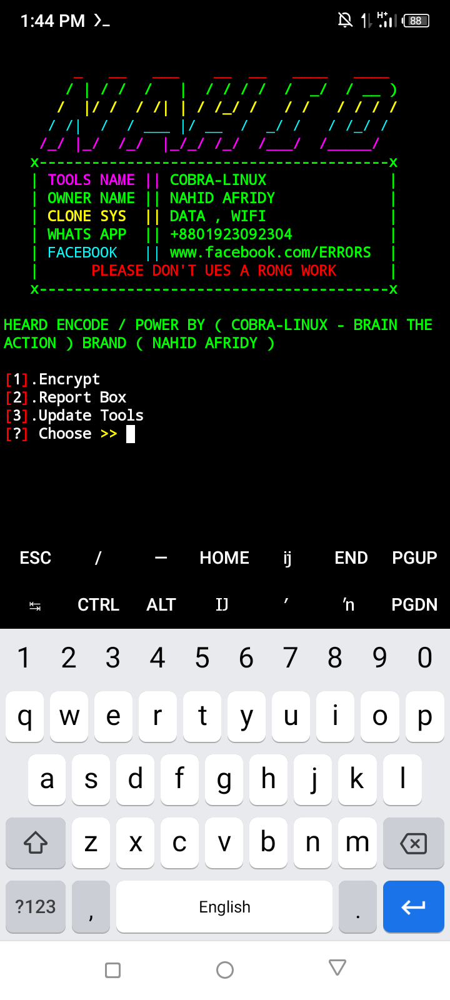
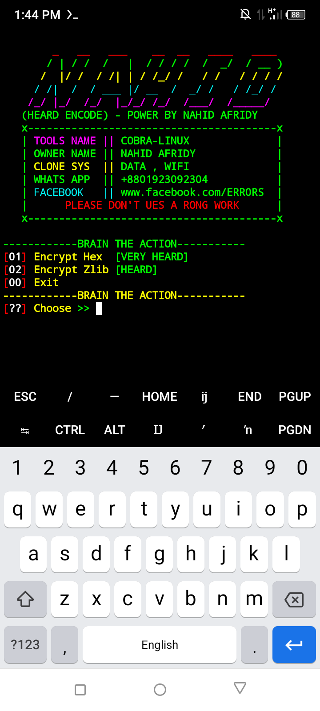

# ENCODE-SYS
This Tools Is a Security in All python Script 🥰 to sys

## Install Method 👇

    pkg install git
    pkg install python
    git clone https://github.com/NAHID-AFRIDY/ENCODE-SYS
    cd ENCODE-SYS
    python2 ENC.py

## ALL TIME RUN 👇

    cd ENCODE-SYS
    python2 ENC.py

#### ENTER VIEW COLLECTION 👇⚡

